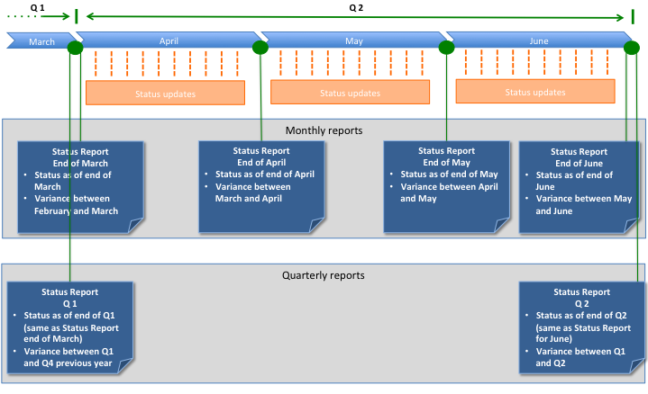

Each project and portfolio should always have an up-to-date status as provided by the _status updates_ . 
This updates are changes to the "current state" and should be issued as often as required, in general anytime
there are events that materially impact the project or portfolio status (including its estimated performances).

A _status report_ is different from a status update in that it is a periodic picture of the current state 
against some past state. For example, a monthly project status report issued at the end of month, will provide a picture
of the project as of the time of issuing the report (end of month) showing its variance against the data from the 
last month report (issues at the end of the previous month). In this example, status updates have been issued 
throughout the month (or at least before the issuing of the report) to ensure the latest status is reflected within 
the project or portfolio.

_Example of project status report flow:_

