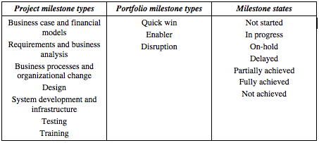

## Change requests

**Project change requests** are formal documents raised by a project to record a
change in the project performances.

Each change should report a reason for change from a standardized list.

Example of _reasons for change_:

  + Scope change
  + Staff issues
  + Inaccurate estimates

As the request is discussed and evaluated, it should be possible to capture the different request states.

Example of _change states_:

  + Submitted
  + Approved
  + Rejected
  + In progress
  + Completed

Request priority should be captured for each request to indicate its importance and
usually its precedence above others because of its criticality.

Each change should have an internal identification number, a title and a set of
raised on / delivery dates.

**Portfolio change requests** are similar to project change request but refer to a
whole portfolio rather than a project.

Project managers create project change requests for a specific project whenever
needed and present them to the portfolio manager.
Often these requests are accompanied by requests for extra funds.
However, portfolio managers in turn are usually able to present all the project
changes in their portfolio, and the accompanying net fund changes, to management
only at set times (e.g. monthly). Therefore, portfolio change requests should be
able to bundle different project change requests in one document and provide
any separate summary data.

## Issues

**Project issues** indicate any problems impacting the success of the project.
Each issue should report its state, priority and cause in a standardized manner.

Additional, each issue should have an internal identifier number, a title and a
set of raised on / resolution dates.

**Portfolio issues** are similar to project issues but refer to a whole portfolio
rather than a specific project.

A portfolio issue should be able to bundle different project issues.
Portfolio managers need the ability to escalate the issue on behalf of the
projects and record any escalation actions requested to any senior stakeholders to
support the issue resolution.

_Example of issue management data:_

## Milestones

**Project milestones** identify key deliverables in the project lifecycle.
For each project and gate, milestones should be recorded. The different points in
the life of a milestone should be recorded with standardized milestone states
along with its delivery date. Although the mile-stones are project-specific,
they should be categorized in milestone types that are standardized across all
projects for comparability.

**Portfolio milestones** refer to major delivery points at portfolio level.
For this reason, portfolio milestone types should be separate from the
project milestone type and be standardized across all portfolios.

Portfolio milestones should be capable of referring to a bundle of project milestones
that are required for their achievement.

The history of all changes to milestones’ delivery dates and issues’ resolution
dates should be recorded in time and accessible for auditing and trending analysis.

_Example of milestone management data:_

## Delivery status

This the periodic reporting of the delivery status of each project at each gate.

Each project status document should report the period it refers to and a
standardized status indicator (e.g. red/amber/green) with a status comment.

Detailed status information may include:

  + Standardized status areas, with status indicator and status comment, to provide a higher level of granularity to the report
  + Status about the current achievement of the expected gate outcomes
  + New estimate values for any gate performance as applicable

Similarly to the project status, portfolio status documents should be used to report the status at portfolio level.
