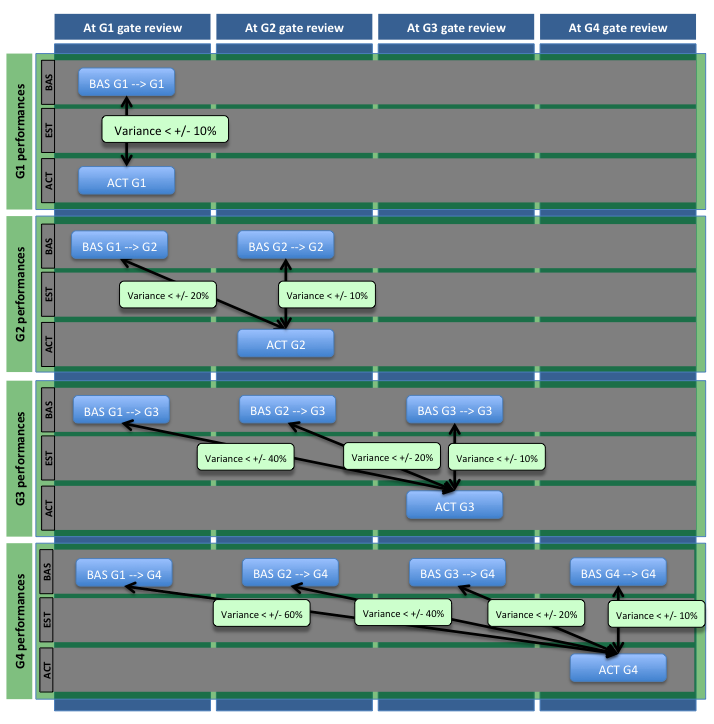

## From Stage/Gate to "Agile Gate Management"

One of the most adopted project control practices is the "stage/gate" approach.
This approach was first introduced by the product development community and later adopted by several de-facto methodologies,
such as Prince2.

Stage/gate is often associated with the "waterfall" approach since, in its essence, it requires the division of any project lifecycle
in consecutive and not overlapping stages. The start/end of each stage is marked by a gate where a decision is made
about proceeding or stopping with the reminder of the project. This decision is based on the satisfactory achievement
of certain predefined outcomes for that stage/gate.

In the enterprise world, the most common applications of this approach tended to align the stage/gates to the classic
delivery phases of a business-IT projects of analysis-design-build-test-production. Such a process within an
organization was then generally imposed as a "one standard" to which all projects would have to abide.

In these practical implementations of the stage/gate process, usually the gates were sees predominantly as a checkpoint
to ensure a set of specific must-have deliverables were produced and signed-off.

This standardized approach should have provided the following benefits:

 + Facilitate management control and comparability between projects
 + Support adherence to auditing and governance regulatory requirements
 + Ensure adoption of what were generally accepted industry best practices
 + Provide a common language among project stakeholders

These benefits however started to decline as wider internal and external changes took place:

 + Project exposure and maturity has increased across the board for both suppliers and customers of projects, making
 stakeholders capable of making "fit for purpose" decisions that, in the specific situation, were better than the
 prescribed standard best practices.

 + Business users have become more IT and change literate. This, together with the explosion of cloud solutions that
 can be, at least initially, adopted without internal IT departments, as made the so called "shadow IT" more of a norm than
 an exception. Consequently, what once would have been projects under tight control of a specialized internal organization,
 became ad-hoc initiatives carried out directly by the interested users.

 + Agile has grown from a pure software development method to a wider organizational management discipline in direct
 contrast with the established, one-size-fit-all, waterfall practices. Continuous and early delivery of partial functionality
 to production, sprints, fast-prototyping etc. have become incompatible with a traditional waterfall model.

This has increased friction and resentment within organizations. On one side, the roles responsible for
project management and governance/audit cannot find ways to accommodate deviations from their standard without their
control system failing. On the other side, the sponsors and the working delivery teams feel trapped in bureaucracy and
slowed down by red tape that does not seem the best for the successful delivery of the work at hand.

The taoPPM's "Agile Gate Management" approach wishes to bring back together this two worlds by marrying the advantages
of the waterfall approach regarding management support and risk control with the need for a more personalized and agile
delivery process of a specific project.

## Agile Gate Management manifesto

Agile Gate Management evolves the current general implementations of stage/gate approaches based on the following
tenants:

+ No more project phases but only performance gates
+ Focus on project performances rather than activities
+ As many gate process models as projects

### No more project phases but only "performance gates"

The terms stage and phase are in practice used interchangeably. Therefore they usually refer to the highest level of
aggregation for the project's activities either as an outcome of WBS (work breakdown structure) or PBS (product breakdown
structure) analysis. Since gates mark the end of a stage (or the start in the case of project start gate), it
became natural to have stages and gates that mirror a "most common" technical delivery process.

Agile Gate Management requires the shift from a stage (or phase) thinking to a pure gate view point. Breaking the reference between a
gate and any technical or specific project delivery phase helps in looking at gates as pure performance audit point
for the project.

Any projects should always have at least two gates: **start** and **end**.

Additional **interim gates** should be added at specific points in time in proportion to the need of stricter control.
However, more gates means also more costs in oversight activity, both for the governance controllers and the team
having to achieve (and prove) adherence to the governance expectations of each gate.

The number of intermediate gates between start and end should provide a balance between the extra overhead and the
tighter controls. This can be achieved considering the following characteristics for each project:

+ Risk
+ Strategic importance and budget
+ Type

Risk includes both the risk of delivery failure and the operational risk carried by the project. The riskier the project,
the higher should be the number of gates.

Although it is true that strategically important projects may not require large budgets, rarely a project requiring
a company to make a large financial investment is not considered strategically important. Additionally, governance
regulation often focuses on the financial control aspects of management. For all these reasons, strategic importance an
budget can be considered together. In practice, often budget finds widespread use as a proxy for strategic importance.
The bigger and more strategically important a project is, the higher should be the number of gates.

Different type of projects will need different technical implementation processes. For example:

+ A custom software development will be better served with a SCRUM approach
+ A packaged software implementation (especially for larger enterprise software vendors) will come bundled with a well
defined and tried vendor methodology (e.g. ASAP method for SAP).
+ A process improvement initiatives may follow one of the standard Six Sigma approaches (e.g. DMAIC)
+ A hardware or equipment implementation would have a process centered around a purchasing and installation activities.

Considering gates and not phases does not mean disregarding what the best technical implementation process for a project
should be. Evaluating what is the best way to structure gates and their performances to support the actual technical
delivery process is an important step in defining when and how many gates to have.

### Focus on project performances rather than activities

Each gate is defined by a set of performances. These performances cover the key dimensions of a project: time, cost and
output completion. Each dimension will have an estimate, a baseline and an actual value.


#### Performance dimensions

##### Time

The time dimension is represented by the _gate dates_ and the time difference between any two consecutive gate dates,
the sum of the latter will provide the project _duration_.

##### Cost

The cost at each gate represents the cost sustained by the project between this gate and the previous gate.
The start gate costs can be used to represent the costs that were sustained before formally starting the project.

##### Completion

The amount of completion at each gate represents the amount of output completed between this gate and the previous gate.
Although any unit of output can be chosen to represent the level of completion at each gate, this should be standardized
within a project and across all projects to ensure correct comparability between project performances.
An example of standardized unit of project output is the use of **function points**.

#### Performance values

##### Estimate

An estimate is the _expected value_ of a gate performance. Therefore it represents the most probable amount given the
the most current information available. Since this may change overtime and should always be kept up-to-date by changing
any current gate data with the latest expectations. At any given point in time, the current estimate for gate can also
be thought of as its expected actual value with today's information.

##### Baseline

A baseline is the _agreed value_ for a gate performance. This will be used as the target against which appraise delivery
performances. This therefore should be a firm value and should not change over time unless there is a change in the
project mandate itself. A common example of why a baseline should be change is when the project scope objectively changes.

##### Actual

The actual value of the performance is the value that has eventually happened.

#### Budget

A budget for a gate is the amount of _company's funds_ that have been formally assigned to that gate. The sum of all gate
funds is the total _project budget_. This amount is usually based on the available estimates for the project at the time
the funding decision is made and it is usually the amount captured in the company's financial records.

Budget assignment is a formal commitment that is usually made only later in the portfolio management process when
the funded project has successfully passed the selection process. In earlier phases, such as during the definition
phase of projects identification, it is common to identify only what could be a future _potential budget_ in the form
of **earmarked funds**. This amount is usually based on very early educated guesses of project costs and sometimes they
better describe the "desired" amount stakeholders wish to spend on an initiative rather than its potential cost.

#### Variances

Variances are the _differences between estimates, baseline, actual and budget_. These differences can be expressed both
in absolute value or as a rate.

Gate variances, that can also be _cumulative_ as the project progresses through the gates, are:

+ Baseline variances
  + Variance between estimate and baseline = (baseline - estimate) / baseline
  + Variance between actual and baseline = (baseline - actual) / baseline
  
+ Budget variances
  + Variance between estimate and budget = (budget - estimate) / budget
  + Variance between actual and budget = (budget - actual) / budget
  + Variance between baseline and budget = (budget - baseline) / budget
  + Variance between earmarked funds and budget = (earmarked funds - budget) / budget

In all the above _negative values mean that we are spending more (or taking longer, or producing more output) than what was originally targeted_.

#### Earned Value Analysis (EVA)

EVA is a way to provide a simpler answer the question "Is the project performances on track?".

This is because the only way to _fully_ answer such as question is to break down the question in its three components
questions and answer each one of them separately at the same time:

+ "Are we spending as much as expected?"
+ "Are we taking as much time as expected?"
+ "Are we producing as much output as we expected?"

The answers to each of the above component questions must be _combined together_ to truly and fully understand if
the project is on track. EVA tries to make this combination easier and more straightforward.

```
Let's assume we expect to build a 2 floor house in 12 months, with each floor taking 6 months and costing $100 each.
After 3 months, we completed 90% of the first floor and spent $95. Are we on track?
```
Just knowing that we took 3 months instead of closer to 6 to almost complete 1 floor is not sufficient to claim that we are ahead
of what were our initial plans. Similarly, claiming that we are still on budget just because we have spent less than the
planned amount of $100 is also not sufficient.

Initially we could answer this question by providing three separate pieces of information:

+ We have almost completed a floor at 90%
+ We are at only half the time to what would be required to complete a floor
+ We spent $ 95 (against a budgeted amount of $ 100 for a full floor)

With this articulated answer, we are now required to mentally workout the interrelations between the different variables
and decide if this is good or bad. Additionally, this information as it stands now would make it very difficult to make
predictions on the future.

EVA puts together these separate pieces of information and works out their interrelations creating a framework to better
and more precisely understand if we are on track.

EVA applies the fundamental principle that the output completed has value equal to its agreed budget rather than the
amount actually spent. This means that:

+ Since one floor was valued at $100 and we completed 90% of a floor, the value of our output is 90% * $100 = $90.
This is called _earned value_.
+ Assuming a linear distribution of the output, since we are half way through the 6 months required to build a floor,
we should now have built 50% of a floor, which is valued at $100 * 50% = $50. This is called _planned value_.
+ However, the actual cost for the period was $95

Now we are able to calculate the following EVA indicators:

+ Cost variance (CV) = Earned Value (EV) - Actual Cost (AC) = $90 - $95 = - $5 => We have an overspent of $5
+ Schedule Variance (SV) = Earned Value (EV) - Planned Value (PV) = $90 - $50 = + $50 => But we have overachieved
the schedule by $50

Expressing variance in the schedule in terms of value ($) is counter-intuitive. A method to translate this into time is
to use the concept of _Earned Schedule_ (ES). To find this value we need to ask ourselves where would we be in the schedule
if the planned value equaled the earned value. So, assuming a 30 days month, each day required to build a floor is valued
at $ 100 / (6 * 30) = $ 0.555. Therefore, $90 of earned value would "buy" 90 / 0.555 = 162 days. This amount of 162 days is the
earned schedule. Since we are now at 3 months (90 days), we can calculate the schedule variance in terms of days:

+ Schedule Variance in days (SVdays) = Earned Schedule (ES) - Actual Time (AT) = 162 - 90 = 72 days => We are 72 days
ahead of schedule

The _cost performance index_ will then tell us how efficiently we are using our funds:

+ Cost Performance Index (CPI) = EV / AC = $90 / $95 = 0.94 => Therefore we have a lower efficiency and we get
only 94% of every dollar we put in our project

The _schedule performance index_ (in days) tell us how efficient we are with the time provided:

+ Schedule Performance Index in days (SPIdays) = ES / AT = 162 / 90 = 1.8 => Therefore we have a higher time efficiency
and every day we work we reduce the required schedule by 1.8 days instead of just 1
+ Schedule Performance Index in currency (SPI$) = EV / PV = $90 / $50 = 1.8 (Here this equals to the SPIdays because of
our simplified example but this not to be expected)

Remembering that the _budget at completion_ (BAC) for our project to build both two floors was $200,  and that the
_planned duration_ (PD) was 1 year (30 * 12 = 360 days), we are now in a position to
make _future predictions about the final cost and the end date of our project_:

+ Estimate At Completion (EAC) = AC + ( (BAC - EV) / (CPI * SPI$) ) = $95 + ( ($200 - $90) / (0.94 * 1.8) ) = $160 =>
With today's knowledge and assuming no changes in our efficiency, we will spend $40 less to complete our project
than initially thought
+ Estimate Duration (ED) = PD / SPIdays = 360 / 1.8 = 200 days => Therefore we will need 160 days less to complete
the project than initially thought.

#### Estimation accuracy

One of the key objectives of mature project management organizations is the capability to delivery projects 
_successfully_, _consistently_, and _predictably_.

Predictability of projects, and consequently of the expenditures associated with them, is important not just from a 
project management perspective but also from an operational perspective. Project predictability, especially for enterprises
that are highly projectized, has a direct impact on the predictability of the company's cash-flows which is often 
an objective of most financial regulations.

This requires a strong estimation process that can be continuously improved. Setting the performances baselines for 
future gates at each gate and then comparing their variance against the actual values, allows the measurement of the 
estimation accuracy and the setting of tolerances.



### As many gate process models as projects

Agile Gate Management makes a separation between the gate process for portfolio management and the project
management delivery methodology. In many PMOs this is often not the case, and all projects are required to follow the
same "standard" stage/gate methodology for the PMO to be able to aggregate project performances at portfolio level.
Instead, gate performances as defined here, can be aggregated independently of the number of gates and of the
underlying activities the project performs to arrive to a gate.

This means that projects can now follow mandated best practices in terms of methodology and phases
not tight to the one-size-fit-all method but many methodologies can be freely defined in any number to suit all the possible variety
of project instances. For each project, a decision can be made to follow one of these best practices as-is
or modify it to create a personalized version that would best suit the project. This personalization process, called
_fit for purpose_ is encouraged and will not break the portfolio management and governance processes thanks to the focus
on aggregating gate performances.

Instead of a standard methodology, project management departments can now offer a portfolio of different
**process template methods**. If this choice of process templates is composed by a wide variety of high
quality proven processes, a project would be hard-pressed not to find a method that would suit its situation,
this would reduce the need for fit for purpose activity unless properly justified.

Each gate in a process template will list a set of **gate outcomes** that can be used as a checklist of what is expected
by the project to pass the gate. Not only these outcomes should now be better aligned to the nature of the process
but can also tailored to the specific needs of the project during the fit for purpose activity.

Gate outcomes are evaluated by assigning **outcome scores** as part of the gate review. The same scoring system can then
be used to score the achievement of the gate overall and register its state (e.g. "approved" or "rejected").

_Example of gate management process templates:_

