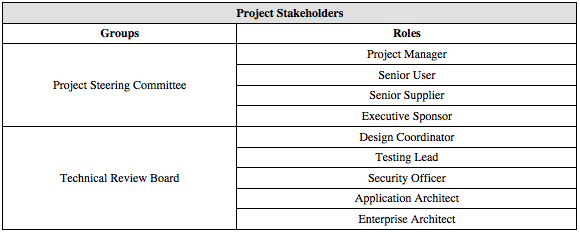
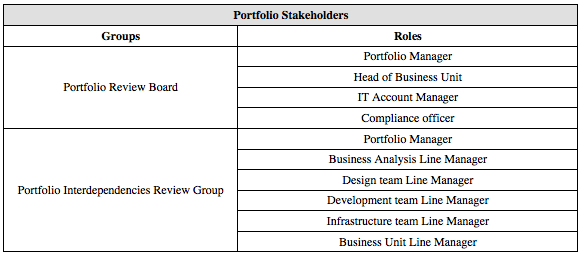

There are different definitions and models of stakeholder management but most agree on the general objectives, 
approaches and activities.

The overall objective of stakeholder management is to guard and maximize project success from stakeholders’ 
activity. 

This objective is usually achieved by categorizing stakeholders in different groups and, based on the specific needs 
of the group, put in place differentiated and systematic stakeholder management activities. 
Systematic categorization can be achieved by providing all portfolios and projects with a defined taxonomy of 
stakeholder groups, roles and categories.

Stakeholder management activities usually centre around ensuring people’s expectations are aligned to those of 
the project and this is mainly achieved through proper communication, relationship management and engagement in 
goal setting and acceptance.

## Stakeholders groups

Although the definition of stakeholder can be so generic to encompass a very large range of individuals for any 
project, key stakeholders from a portfolio management perspective are usually involved within project and 
portfolio on formal governance bodies. If well designed, these governance bodies should strike a balance between 
avoiding the involvement of too many people and ensuring sufficient representation. In this way, decision making 
lead-time is optimized and the tracking and analysis effort is manageable.

Stakeholders can be modelled with the use of _stakeholder groups_ where each group represent a set of _stakeholder roles_.
_People_ can then be assigned to a role. The same person may carry out multiple roles.

In order to ensure proper levels of governance oversight and business benefit validation, 
both at portfolio and project level, different standard groups of stakeholders should be identify. This would
ensure a standardized approach to stakeholder management across different projects.

However, each project and portfolio requires the flexibility to define the different roles and associated people that 
best would support the achievement the expected objectives of the stakeholder group.

_Example project stakeholder groups and roles:_

_Example portfolio stakeholder groups and roles:_

## Stakeholder categorization

Categorization of stakeholders helps practitioners tailor their engagement approach to best suit the different 
nature of stakeholders.

There is a wide variety of categorization models, such as:

  + Internal/External
  + Soft systems taxonomy
  + Salience level
  + Power/Interest grid
  + PMI's engagement level
  + OGC's stakeholder taxonomy
  + Engagement approach
  
Each of these categorization models can be represented as _stakeholder category_ (e.g. Salience level category) that 
can hold a different _stakeholder category value_ for each specific stakeholder and role.
