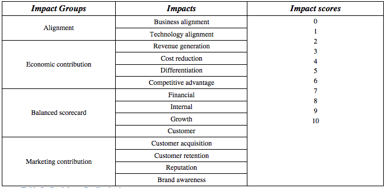

This analysis is used to evaluate different impacts the projects may have on the business that are
_non-monetary_ and qualitative in nature, such as qualitative business indicators that are specific
to the industry or the type of project.

Additionally, this analysis can be used to perform a qualitative evaluation of financial costs and
benefits if a full numerical financial analysis is not required (for example during the initial
phase of a business planning cycle).

**Qualitative impacts** can be grouped in **impact types**.

An impact score is assigned to each impact. This is expected to be a numerical positive scale
(1 to 10 or 1 to 5 are commonly used). The numerical nature of the scoring will allow calculation
of averages and comparisons between projects. To this end, the scoring scale is the same for all
impact types and projects.

_Example of qualitative impacts:_

