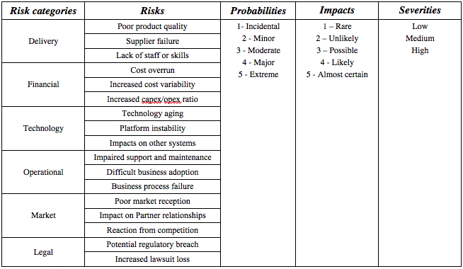

The risk analysis is used to evaluate how individual projects contribute to different risks.

Risks can be grouped in **risk categories** (business, delivery, technology, commercial etc.).
Each risk for each project is evaluated by assigning a **risk impact** and a **risk likelihood**.

Different combination of impact and likelihood will be summarized in **risk severity** values.

These scales will be qualitative but a numerical amount should be assigned to allow numerical
comparisons between projects.

_Example of risk categories:_

