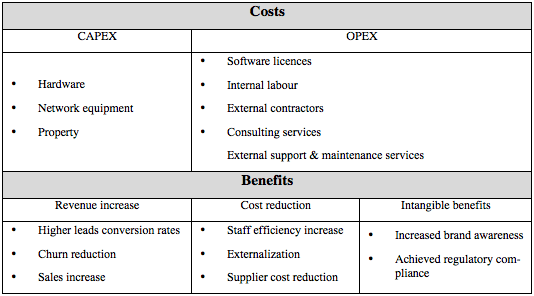

This area entails the financial analysis of projects through definition of cost and
benefit components and calculation of financial indicators.

**Cost** and **benefits** can be grouped in cost and benefit types.

To ensure comparability between projects, cost and benefits item headers should be
the same for all projects. However, each project will identify a specified amount
and year for each item header. If relevant, it should be possible to assign a cost
or a benefit to a specific delivery process gate.

_Example of financial costs and benefits:_

All cost and benefit items should be discounted with a predefined **discount rate**
and **base year**.

The **payback period** calculates the length of time required to recover the entire
cash out-flows of the proposed investment. The “modified” payback algorithm takes in
consideration cash outflows also after the starting period.

The **net present value (NPV)** is the difference between the total discounted
benefits and the total discounted costs. The higher the NPV, the more value the
project creates.

The **benefit cost ratio (BCR)** is the ratio between the total benefits and the
total costs. A higher ratio indicates a higher return.
