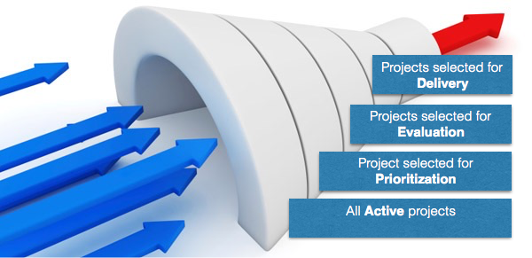

The organization's commitment to a project evolves as the project
is selected to move throughout the PPM process.

Selecting a project expresses its suitability to be delivered and in general on its
value as an investment for the company.

Generally, after identification, the first level of commitment an organization
has to make is to decide if the project is worth taking forward in the prioritization
process. Based on the outcome of the prioritization, some of the projects will
be selected for further evaluation (financial, qualitative, risk, etc.).
The evaluation will be used to decide which projects should actually be delivered
and brought to completion.

This selection process can be better described as **selection funnel**:

