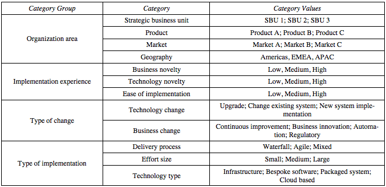

Categorization is the process of classifying projects based on categories that represent different project
characteristics or any meaningful grouping of projects. Categories are then used as the basis for decision-making,
comparison or management.

Within each _category_, project will have different _category values_. Multiple categories can be grouped in _category groups_.

_Example of project categories:_

