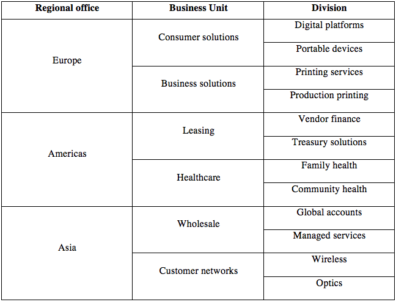

If the strategy decomposition tree ensures that the work to be done has a strategic value,
the portfolio decomposition structure ensures its delivery accountability.
This accountability may follow the organization’s hierarchy, its functional lines and other business dimensions
such as markets, geography or product categories.

Each identified project should be assigned to a portfolio. Portfolio can be categorized by _portfolio type_.
A _portfolio manager_ heads a portfolio.

_Fictitious example of portfolio structure:_

