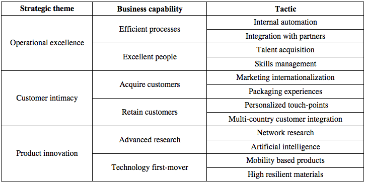

## Strategy tree

Business strategy statements are usually formulated at a too high level of abstraction to be useful for
identifying new projects or to align already identified projects to the strategy.
Therefore, it may be necessary to decompose strategic goals down multiple hierarchical levels of increasing tactical value.

This hierarchical decomposition is represented in a _strategy tree_. Each level in the tree is a _strategy node_.
Strategy nodes can be of different _strategy node type_.

Although projects may support the achievement of multiple strategic goals, a project should be aligned to the
strategy node that best represents it. This facilitates decision making and may expose further improvements to either
the definition of the project or of the strategy node to achieve better  “mutually exclusive, completely inclusive” characteristics.

_Example of strategy tree on three levels:_

## Projects identification

Identification of new projects may be approached in several ways.
In general, these can be bottom-up, top-down or a combination of the two.

Examples of bottom-up approaches are ide-as gathering processes from employees or
working team’s brainstorming sessions.

In a top-down approach, management usually directs the change initiatives as part of a wider business and strategic planning.
All of these methods share the same need to harness the organizational creativity for business improvement.

Independently from the project identification process adopted, a clear and agreed strategic tree should be available to act as a reference.

Since it is usually common that there are more ideas than resources to support them, the identification activity
should capture sufficient information about the project ideas to enable a fair analysis without stifling the creative process.

Minimum key identification data for each project idea include:

   + Requested start/end date
   + Earmarked funds
   + Description
   + Identification handles such as id and name
