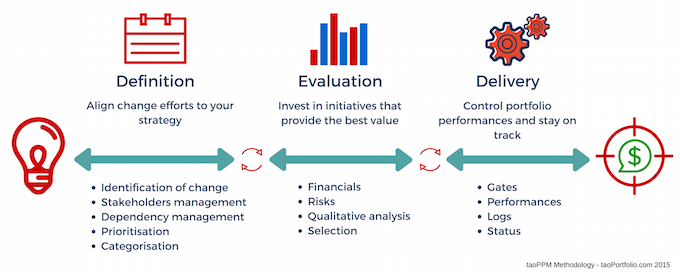

Project portfolio management is a relatively new discipline concerned with the challenges of managing multiple projects at once.

The role of “portfolio manager” has emerged in enterprises with the responsibility of managing this process.

The project portfolio management process comprises three main sub-processes: a portfolio definition sub-process,
responsible for the projects identification, categorization and prioritization; a portfolio evaluation sub-process,
responsible for the analysis of the financial, qualitative and risk profiles of projects; and finally
a portfolio delivery process, responsible to bring the projects to completion within controlled duration, cost, and quality performances.

Although there are already different methodology and applications targeting this area, our method wants to provide a
superior support to strategic alignment and gate-based performance auditing which we believe are central to successful
governance and management control.

The concepts captured by this methodology are not new and have been already used in the industry. However, at times
these concepts have been diluted with other practices or they have not been clearly delineated and separated. Additionally,
some of the existing advise borders the academic by requiring a level of maturity and sophistication that breaks down in the imperfect real-world.
This has hindered enterprises from taking full advantage of project portfolio management.

> taoPPM has been created by distilling available methodologies and practices in light of our experience to a simpler and more focused set of recommendations. In this way, managers can first and foremost focus on the 20% of project portfolio management that yields 80% of the advantages
